# Agent Architecture — AI-Powered Adaptive Spoken English Learning Platform

This document defines the **complete agentic system design** for the platform, covering the number of agents required, their roles, the orchestration pattern, LangGraph state machines, inter-agent communication, and tool assignments. All diagrams are in **Mermaid** syntax compatible with Eraser.io.

---

## Summary: How Many Agents?

**Total: 11 Agents**

| # | Agent Name | Type | LangGraph Role | Primary Responsibility |
|---|-----------|------|---------------|----------------------|
| 1 | Assessment Orchestrator | **Orchestrator** | `StateGraph` root | Drives the full learner assessment pipeline end-to-end |
| 2 | Recruiter Screening Orchestrator | **Orchestrator** | `StateGraph` root | Drives the full recruiter candidate-screening pipeline |
| 3 | Question Selector Agent | Sub-Agent | Node in Assessment graph | Selects equivalent-form questions by level, pathway, and history |
| 4 | Speech Analysis Agent | Sub-Agent | Node in Assessment graph | Coordinates STT transcription + acoustic feature extraction |
| 5 | Rule-Based Evaluator Agent | Sub-Agent | Node in Assessment graph | Applies grammar, lexical, fluency rule-based scoring |
| 6 | AI Coherence Evaluator Agent | Sub-Agent | Node in Assessment graph | Makes the ≤2 Vertex AI calls for coherence/relevance scoring |
| 7 | Feedback Composer Agent | Sub-Agent | Node in Assessment graph | Synthesises all scores into corrected transcripts, explanations, model answers |
| 8 | Learning Pathway Agent | Sub-Agent | Node in Assessment graph | Generates personalised weekly learning roadmaps from weakness profiles |
| 9 | Risk Monitor Agent | **Background Agent** | Scheduled `StateGraph` | Continuously scans for stagnation/decline; fires teacher alerts |
| 10 | Classifier Agent | **Infrastructure Agent** | Pre-orchestrator gate | Classifies every inbound request by role, intent, and pathway; routes to the correct orchestrator |
| 11 | Context Manager Agent | **Infrastructure Agent** | Cross-cutting shared service | Manages short-term (Redis) and long-term (PostgreSQL) context windows for all orchestrators |

> **Design Pattern Used:** Hierarchical **Orchestrator → Sub-Agent** pattern implemented with **LangGraph `StateGraph`** for orchestrators and **LangChain `Tool`** definitions for sub-agents. Agents 10 and 11 act as **cross-cutting infrastructure** that every orchestrator uses before starting its own state machine. All traces flow through **LangSmith** for observability and cost tracking.

---

## 1. Agent Roles & Responsibilities

### Orchestrators

#### Agent 1 — Assessment Orchestrator
- **Trigger**: Learner initiates an assessment session via the frontend
- **Responsibility**: Manages the full state machine from profiling → question selection → speech capture → scoring → feedback → pathway generation
- **Owns**: `AssessmentState` (LangGraph state object)
- **Coordinates**: Agents 3, 4, 5, 6, 7, 8
- **Conditional branching**: Routes to CEFR pathway or IELTS pathway based on learner goal
- **Error handling**: Retries on STT failure; gracefully degrades AI scoring if Vertex AI is unavailable

#### Agent 2 — Recruiter Screening Orchestrator
- **Trigger**: Recruiter initiates a candidate screening session
- **Responsibility**: Manages the full recruiter flow from rubric loading → question selection → candidate recording → scoring → rubric mapping → ATS export
- **Owns**: `ScreeningState` (LangGraph state object)
- **Coordinates**: Agents 3, 4, 5, 6
- **Conditional branching**: Routes to job-specific rubric mapping based on screening profile

### Sub-Agents

#### Agent 3 — Question Selector Agent
- **Tools**: `query_question_bank`, `filter_by_level`, `filter_by_history`, `randomise_equivalent_form`
- **Input**: User CEFR level / IELTS band, pathway, previous question IDs
- **Output**: Ordered list of 3 equivalent-form questions (Part 1, 2, 3)
- **Rule**: Never repeats a question answered in the last 3 assessments

#### Agent 4 — Speech Analysis Agent
- **Tools**: `call_google_stt`, `extract_acoustic_features`, `normalise_transcript`
- **Input**: Encrypted audio file reference
- **Output**: Transcript text + acoustic metrics (speech rate, pause count, filler word count, articulation score)
- **Constraint**: Operates asynchronously; returns a job ID for polling

#### Agent 5 — Rule-Based Evaluator Agent
- **Tools**: `score_grammar`, `score_lexical_diversity`, `score_speech_rate`, `score_fillers`, `score_pause_patterns`, `map_to_cefr`, `map_to_ielts_band`
- **Input**: Transcript text + acoustic metrics from Agent 4
- **Output**: Structured scoring object `{grammar, lexical, fluency, pronunciation_proxy, composite_rule_score, mapped_level}`
- **Constraint**: 100% deterministic — no AI calls; fully auditable

#### Agent 6 — AI Coherence Evaluator Agent
- **Tools**: `call_vertex_ai_coherence`, `call_vertex_ai_relevance`, `log_api_cost`
- **Input**: Transcript text + question context
- **Output**: `{coherence_score, relevance_score, api_calls_used, cost_usd}`
- **Constraint**: Hard cap of **2 API calls per assessment**; fails gracefully by returning `null` if budget exceeded

#### Agent 7 — Feedback Composer Agent
- **Tools**: `generate_corrected_transcript`, `generate_grammar_explanation`, `generate_vocabulary_suggestions`, `generate_model_answer`, `build_metric_chart_data`
- **Input**: Original transcript + scores from Agents 5 and 6
- **Output**: Complete `FeedbackPayload` including corrected text, explanations, model answer, chart-ready metrics
- **Note**: Uses rule templates for 80% of feedback; LLM only for model answer generation (counts toward the 2-call budget)

#### Agent 8 — Learning Pathway Agent
- **Tools**: `analyse_weakness_profile`, `query_activity_bank`, `filter_by_history`, `build_weekly_roadmap`, `avoid_repetition`
- **Input**: Scoring history + weakness profile + learner goals + activity completion log
- **Output**: 7-day activity plan with activities tagged by skill, level, topic, and difficulty
- **Rule**: No repeated activity within the last 4-week window

#### Agent 9 — Risk Monitor Agent (Background)
- **Trigger**: Runs on a daily cron schedule (LangGraph scheduled execution)
- **Tools**: `fetch_recent_scores`, `compare_against_baseline`, `calculate_stagnation_index`, `flag_at_risk_student`, `send_teacher_alert`
- **Input**: All learner score records for the past 30 days
- **Output**: At-risk student flags written to database + teacher notifications fired
- **Threshold rule**: Flag if no score improvement over 3 consecutive assessments OR score decreases >10%

### Infrastructure / Supporting Agents

#### Agent 10 — Classifier Agent
- **Position in architecture**: Sits at the API Gateway boundary, **before** any orchestrator is invoked
- **Trigger**: Every inbound request from any user (Learner, Teacher, Recruiter, Admin, Research Analyst)
- **Responsibility**: Parses the request, identifies the user's role, intent, and session type, then routes to the correct orchestrator or service. Also pre-classifies the learner pathway (CEFR vs. IELTS) so the Assessment Orchestrator receives a fully labelled context object and does not need to re-ask
- **Tools**: `decode_jwt_claims`, `classify_user_role`, `classify_intent`, `classify_session_type`, `classify_learning_pathway`, `route_to_orchestrator`, `return_clarification_request`
- **Input**: Raw HTTP request headers + JWT token + request body
- **Output**: `ClassifiedRequest` object — `{user_id, role, intent, session_type, pathway, orchestrator_target}`
- **Failure mode**: If intent cannot be determined with confidence ≥ 0.85, returns a structured clarification prompt to the frontend rather than routing blindly

#### Agent 11 — Context Manager Agent
- **Position in architecture**: Cross-cutting shared service called by **every orchestrator** at the start and end of each state machine execution
- **Trigger**: Called by Assessment Orchestrator, Recruiter Screening Orchestrator, and Risk Monitor Agent at `START` and `END` of every run
- **Responsibility**: Provides two-tier memory management —
  - **Short-term (Redis)**: Stores in-flight session state so that an interrupted assessment (page refresh, network drop) can be resumed without re-processing completed steps
  - **Long-term (PostgreSQL)**: Maintains a structured `UserContextProfile` (full assessment history, weakness profile, pathway history, activity completion log) so orchestrators always have a rich, up-to-date context window without querying multiple tables
- **Tools**: `store_session_context`, `retrieve_session_context`, `clear_session`, `get_user_context_profile`, `update_weakness_profile`, `append_assessment_to_history`, `prune_stale_sessions`
- **Input (read)**: `user_id` + `session_id` → returns `UserContextProfile` + `SessionState`
- **Input (write)**: Any orchestrator's partial or final state object
- **Output**: Enriched context object OR confirmation of successful state write
- **Context window rule**: The `UserContextProfile` returned to LLM-backed agents (Agents 6 and 7) is trimmed to the last 3 assessments to keep token usage within the Vertex AI context window budget

---

## 2. Orchestrator–Sub-Agent Architecture Overview

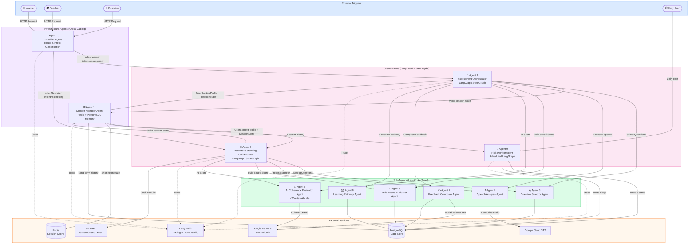

---

## 3. LangGraph State Machine — Assessment Orchestrator (Agent 1)

> State machine governing the full learner assessment pipeline.

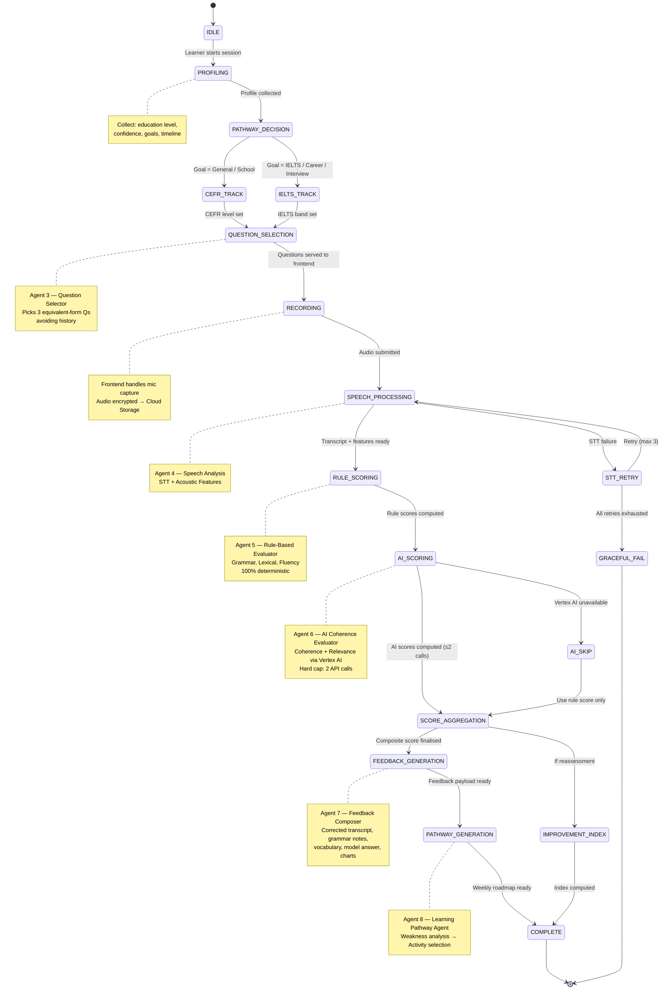

---

## 4. LangGraph State Machine — Recruiter Screening Orchestrator (Agent 2)

> State machine governing the recruiter candidate-screening pipeline.

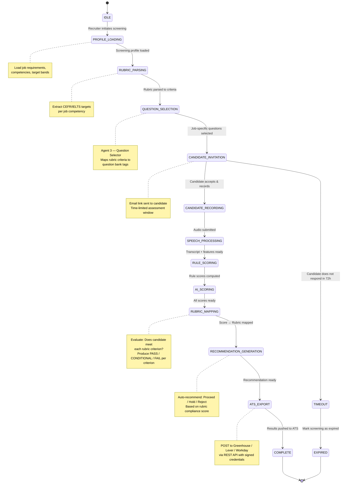

---

## 5. LangGraph State Machine — Risk Monitor Agent (Agent 9)

> Background agent running on a daily cron schedule.

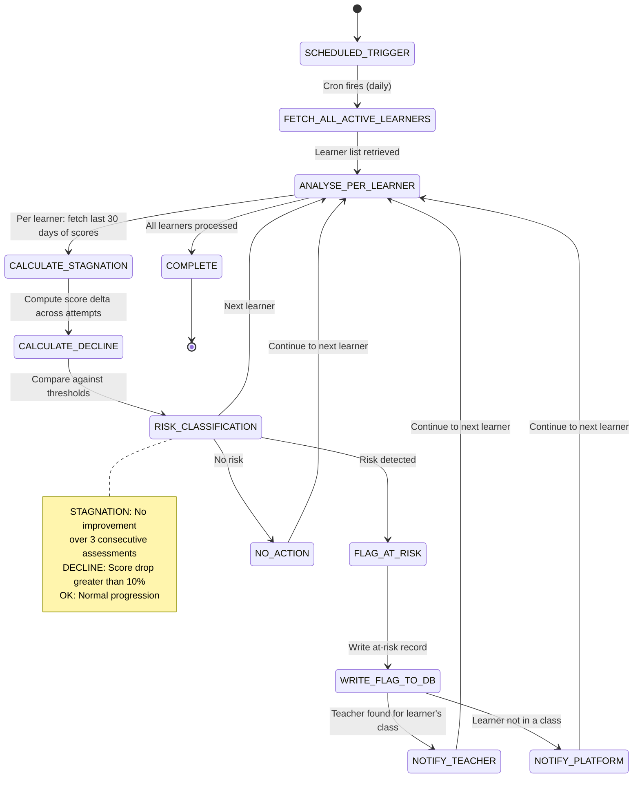

---

## 6. Inter-Agent Communication & Data Flow

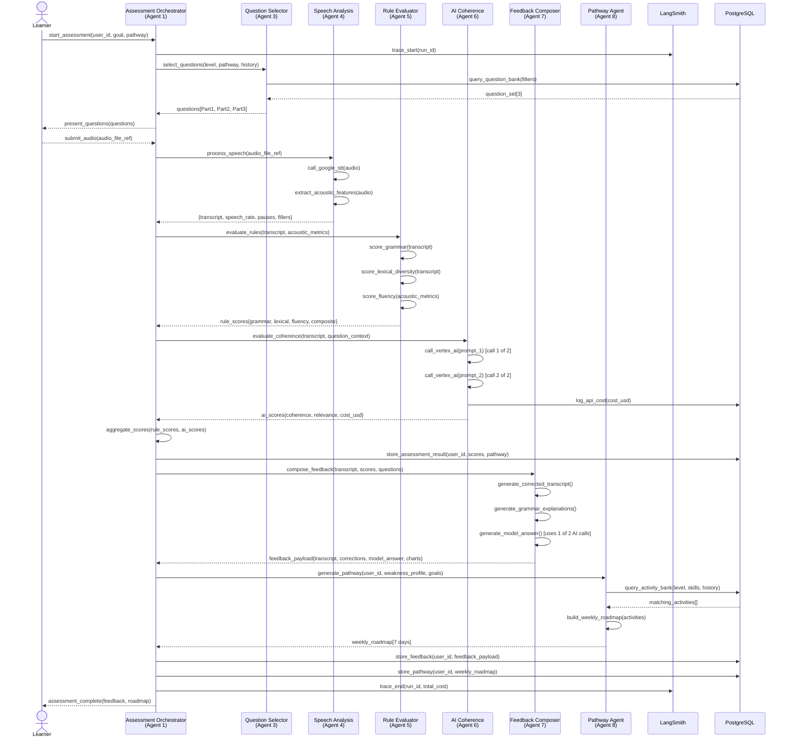

---

## 7. Agent Tool Registry

> Complete list of tools available to each agent.

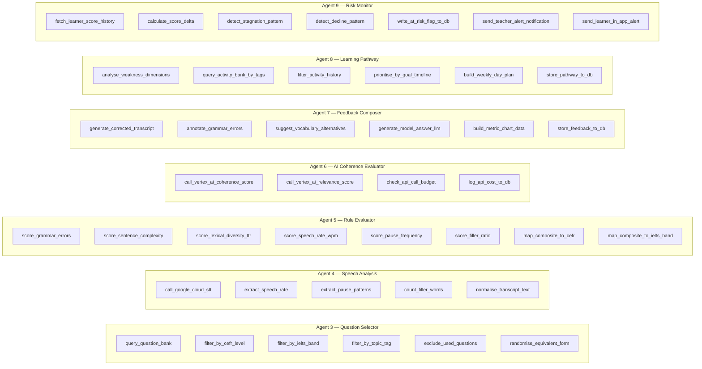

---

## 8. LangSmith Observability Coverage

> Every agent run is traced through LangSmith for cost tracking, debugging, and research audit.

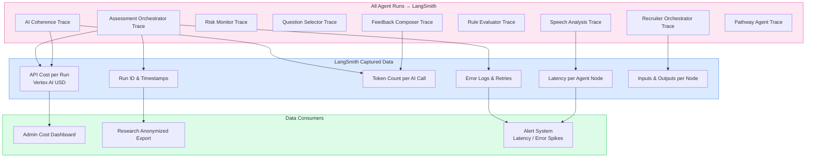

---

## 9. Technology Stack per Agent

| Agent | Framework | LLM/AI Backend | Tools / Libraries | Trigger |
|-------|-----------|---------------|-------------------|---------|
| Assessment Orchestrator | LangGraph `StateGraph` | — | LangChain, LangSmith | Routed by Classifier Agent |
| Recruiter Orchestrator | LangGraph `StateGraph` | — | LangChain, LangSmith | Routed by Classifier Agent |
| Question Selector | LangChain `Tool` | — | PostgreSQL client, pandas | Called by orchestrators |
| Speech Analysis | LangChain `Tool` | Google Cloud STT | `google-cloud-speech`, `librosa` | Called by orchestrators |
| Rule-Based Evaluator | LangChain `Tool` | — | `language_tool_python`, `nltk`, custom rules | Called by orchestrators |
| AI Coherence Evaluator | LangChain `Tool` | Google Vertex AI (Gemini) | `google-cloud-aiplatform`, budget guard | Called by orchestrators |
| Feedback Composer | LangChain `Tool` | Google Vertex AI (Gemini) | Template engine, diff library | Called by orchestrators |
| Learning Pathway Agent | LangChain `Tool` | — | PostgreSQL client, rule engine | Called by orchestrators |
| Risk Monitor Agent | LangGraph `StateGraph` | — | PostgreSQL client, notification client | Cron / `APScheduler` |
| **Classifier Agent** | LangChain `Tool` + FastAPI middleware | — | PyJWT, intent classifier, Redis client | Every inbound HTTP request |
| **Context Manager Agent** | LangChain `Tool` | — | `redis-py`, SQLAlchemy, PostgreSQL client | Called by every orchestrator at start/end |

---

## 10. Classifier Agent — Detailed Design (Agent 10)

### Role in the System

The Classifier Agent is the **single entry point** for every request entering the agent layer. It acts as the intelligent router that inspects every inbound HTTP request and produces a `ClassifiedRequest` object consumed by the correct orchestrator. Without it, each orchestrator would need to independently parse user identity, determine intent, and apply routing logic — duplicating logic and creating inconsistency.

### What It Classifies

| Dimension | Values | Source |
|-----------|--------|--------|
| **User Role** | Learner, Teacher, Recruiter, Admin, Research Analyst | JWT claims (`role` field) |
| **Intent** | `start_assessment`, `view_dashboard`, `initiate_screening`, `join_class`, `export_data`, `configure_bank` | Request path + body |
| **Session Type** | `new_assessment`, `reassessment`, `recruiter_screen`, `teacher_review`, `admin_action` | User history + request type |
| **Learning Pathway** | `CEFR`, `IELTS` | Learner profile goal (pre-loaded from DB) |
| **Orchestrator Target** | `AssessmentOrchestrator`, `RecruiterOrchestrator`, `AdminService`, `TeacherService` | Derived from role + intent |

### Tool Registry

| Tool | Responsibility |
|------|---------------|
| `decode_jwt_claims` | Extract `user_id`, `role`, `institution_id` from the signed JWT |
| `classify_user_role` | Validate and normalise role to one of the 5 known user types |
| `classify_intent` | Match request path + action field to a known intent enum |
| `classify_session_type` | Cross-reference intent with user history to determine session type (new vs. re-assessment) |
| `classify_learning_pathway` | Fetch learner goal from DB/Redis cache and return `CEFR` or `IELTS` |
| `route_to_orchestrator` | Emit the `ClassifiedRequest` to the target orchestrator via internal event bus |
| `return_clarification_request` | If confidence < 0.85, return a structured question to the frontend to resolve ambiguity |

### Classification Flow

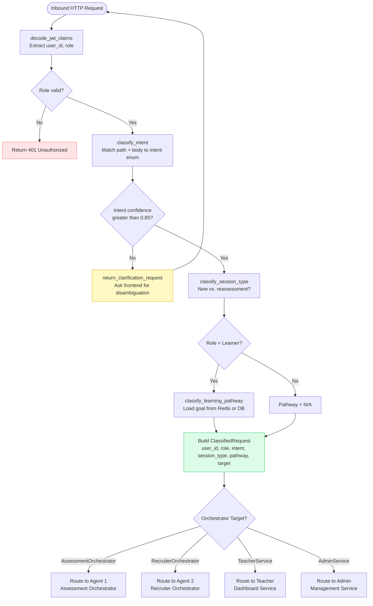

### ClassifiedRequest Object

```typescript
ClassifiedRequest {
    user_id:             str          // from JWT
    role:                RoleEnum     // Learner | Teacher | Recruiter | Admin | ResearchAnalyst
    intent:              IntentEnum   // start_assessment | initiate_screening | view_dashboard | ...
    session_type:        SessionEnum  // new_assessment | reassessment | recruiter_screen | ...
    pathway:             PathwayEnum  // CEFR | IELTS | N/A
    orchestrator_target: str          // AssessmentOrchestrator | RecruiterOrchestrator | ...
    confidence:          float        // classification confidence score
    timestamp:           datetime
}
```

### Why It Matters

- **Separation of concerns**: Orchestrators receive a fully labelled context and never contain routing logic
- **Single responsibility**: All role/intent/pathway classification lives in one agent, making it easy to update without touching orchestrators
- **Auditable routing**: Every routing decision is logged to LangSmith with the confidence score, enabling debugging of misrouted sessions
- **Extensibility**: Adding a new user role or intent only requires updating the Classifier Agent, not all orchestrators

---

## 11. Context Manager Agent — Detailed Design (Agent 11)

### Role in the System

The Context Manager Agent is the **shared memory layer** for the entire agent network. It ensures that every orchestrator always starts a run with a complete, accurate picture of the user's history and active session — and ends a run by persisting the updated state. It prevents data loss on session interruption and keeps LLM context windows within budget by trimming history to the relevant window.

### Two-Tier Memory Architecture

| Tier | Backend | Data Stored | TTL / Retention |
|------|---------|-------------|-----------------|
| **Short-term (Session)** | Redis | In-flight `SessionState` (current step, partial scores, audio job ID) | 24 hours from last write |
| **Long-term (Profile)** | PostgreSQL | `UserContextProfile` (full assessment history, weakness profile, pathway history, activity log) | Indefinite (audit-grade) |

### What It Stores Per User

**`SessionState`** (Redis — per active session):
```typescript
SessionState {
    session_id:      str
    user_id:         str
    orchestrator:    str           // which orchestrator owns this session
    current_step:    str           // last completed LangGraph node
    partial_scores:  dict          // scores computed so far (for resume)
    audio_job_id:    str | null    // async STT job ID if in-flight
    created_at:      datetime
    last_updated:    datetime
}
```

**`UserContextProfile`** (PostgreSQL — per user, always up to date):
```typescript
UserContextProfile {
    user_id:              str
    role:                 RoleEnum
    pathway:              PathwayEnum
    current_level:        str       // CEFR sublevel or IELTS band
    weakness_profile:     dict      // {grammar: 0.6, lexical: 0.8, fluency: 0.5, ...}
    assessment_history:   list      // last N assessments (trimmed to 3 for LLM context)
    activity_log:         list      // completed activities (last 4 weeks)
    improvement_index:    float     // composite progress metric
    last_assessment_date: datetime
}
```

### Tool Registry

| Tool | Responsibility |
|------|---------------|
| `store_session_context` | Write/update `SessionState` in Redis with a 24h TTL |
| `retrieve_session_context` | Fetch `SessionState` from Redis by `session_id`; return `null` if expired |
| `clear_session` | Delete `SessionState` from Redis after successful completion |
| `get_user_context_profile` | Fetch full `UserContextProfile` from PostgreSQL |
| `update_weakness_profile` | Merge new scoring results into the user's weakness dimension weights |
| `append_assessment_to_history` | Add a new assessment record to the user's longitudinal history |
| `trim_context_for_llm` | Return only the last 3 assessments + current weakness profile (token-budget safe) |
| `prune_stale_sessions` | Background cleanup: delete Redis keys older than TTL |

### Context Read/Write Flow

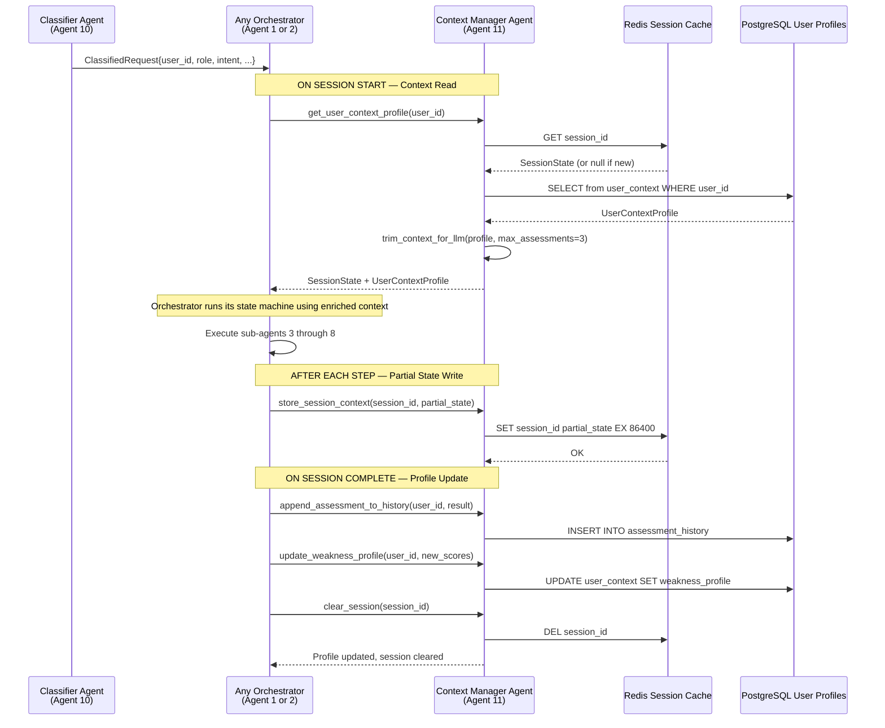

### Session Resume Flow (Interrupted Assessment)

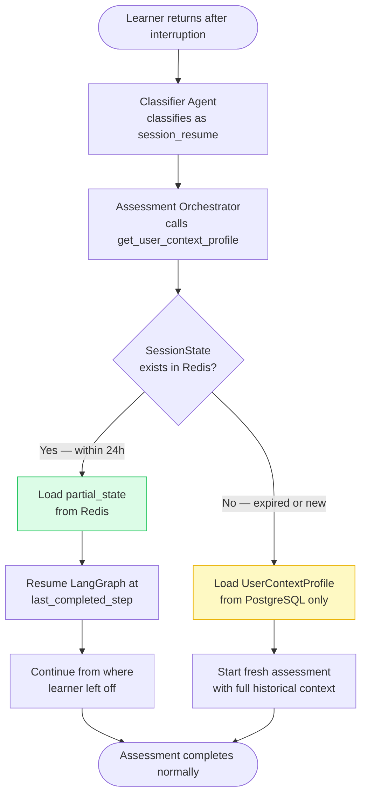

### Why It Matters

- **Resilience**: A network drop or browser refresh does not lose a learner's in-progress assessment — they resume from the last completed step
- **Context quality**: Orchestrators receive a rich, pre-assembled context object instead of querying 4+ tables themselves
- **Token budget enforcement**: The `trim_context_for_llm` function ensures LLM-backed agents (6 and 7) never exceed the Vertex AI context window, keeping AI call costs predictable
- **Longitudinal accuracy**: Because every session end writes to `UserContextProfile`, the weakness profile and improvement index are always up to date for the Risk Monitor Agent, Learning Pathway Agent, and Teacher Dashboard
- **Single source of truth**: All agents read user context from one place; no stale data from concurrent reads

---

## 12. Cost Control Strategy

A critical business requirement is keeping AI costs to ≤2 Vertex AI calls per assessment. The following enforcement mechanism is built into Agent 6 and Agent 7:

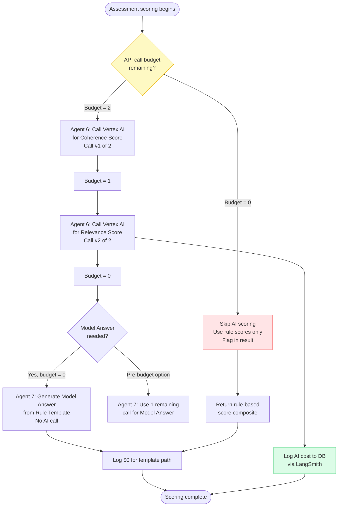

---

## 13. Summary
|----------|-------|-------|
| **Orchestrators** | 2 | Assessment Orchestrator, Recruiter Screening Orchestrator |
| **Sub-Agents** | 6 | Question Selector, Speech Analysis, Rule-Based Evaluator, AI Coherence Evaluator, Feedback Composer, Learning Pathway Agent |
| **Background Agents** | 1 | Risk Monitor Agent |
| **Infrastructure Agents** | 2 | Classifier Agent, Context Manager Agent |
| **Total** | **11** | |

### Implementation Order (Recommended)
1. **Agent 11** (Context Manager) — build the Redis + PostgreSQL memory layer first; everything depends on it
2. **Agent 10** (Classifier) — build the routing gate so all requests are properly labelled before reaching orchestrators
3. **Agent 4** (Speech Analysis) — foundation; everything depends on transcripts
4. **Agent 5** (Rule-Based Evaluator) — core scoring; no external dependencies
5. **Agent 3** (Question Selector) — enables assessments to run
6. **Agent 1** (Assessment Orchestrator) — wires Agents 10, 11, 3, 4, 5 together; MVP-ready
7. **Agent 6** (AI Coherence Evaluator) — adds AI layer on top of rule scores
8. **Agent 7** (Feedback Composer) — completes the learner feedback loop
9. **Agent 8** (Learning Pathway Agent) — personalised pathway generation
10. **Agent 2** (Recruiter Screening Orchestrator) — recruiter flow
11. **Agent 9** (Risk Monitor Agent) — background monitoring; can be added last
