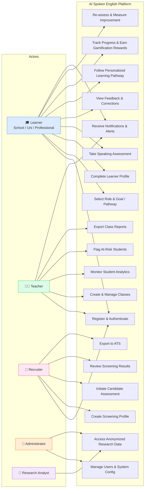
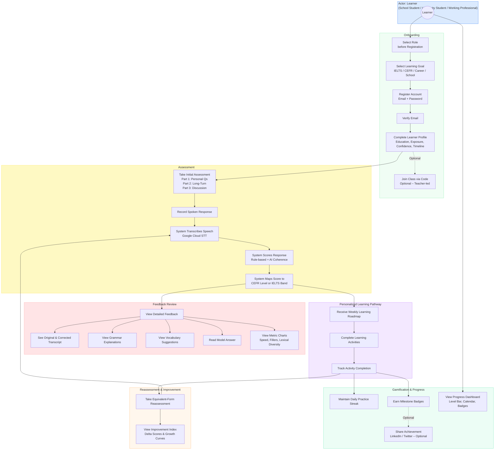
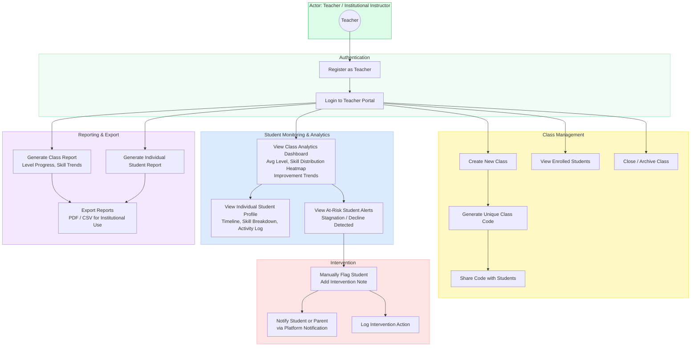
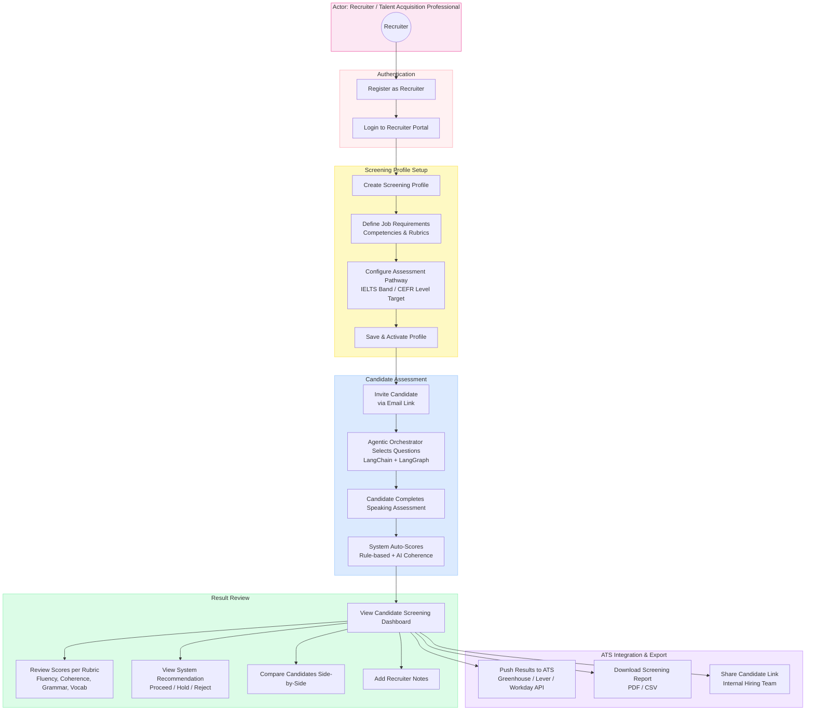

# AI-Powered Adaptive Spoken English Learning Platform — Architecture & Flow Diagrams

All diagrams below are written in **Mermaid** syntax and are compatible with the [Eraser.io](https://app.eraser.io) Mermaid extension. Paste any individual diagram block into Eraser's diagram editor to render it.

---

## 1. Solution Architecture Diagram

> High-level view of all system layers, services, and external integrations.

```mermaid
graph TB
    subgraph Clients["Client Layer"]
        direction LR
        WB[Web Browser\nReact.js + Tailwind CSS]
        MB[Mobile Browser\nResponsive PWA]
    end

    subgraph Gateway["API Gateway / Load Balancer"]
        AG[API Gateway\nNginx / AWS ALB]
    end

    subgraph Backend["Backend Services Layer"]
        direction TB
        AUTH[Auth Service\nJWT + RBAC]
        PROFILE[User & Profile Service]
        ASSESS[Assessment Service]
        SCORE[Scoring Engine\nRule-based + AI]
        FEEDBACK[Feedback Service]
        PATHWAY[Learning Pathway Engine\nRule-based Recommender]
        GAMIFY[Gamification Service\nStreaks & Badges]
        TEACHER[Teacher Dashboard Service]
        RECRUITER[Recruiter Screening Service]
        NOTIFY[Notification Service\nEmail / Push]
        EXPORT[Data Export Service\nResearch / Reports]
        MONITOR[Monitoring & Cost Tracker]
    end

    subgraph SpeechLayer["Speech Processing Layer"]
        STT[Speech-to-Text\nGoogle Cloud STT]
        ACOUSTIC[Acoustic Feature Extractor\nSpeech Rate, Pauses, Fillers]
    end

    subgraph AILayer["AI / ML Services Layer"]
        COHERENCE[Coherence & Relevance Scorer\nGoogle Vertex AI / LLM\n2 calls per assessment]
        AGENT[Agentic Orchestrator\nLangChain + LangGraph]
        LANGSMITH[LangSmith\nTracing & Observability]
    end

    subgraph DataLayer["Data Layer"]
        POSTGRES[(PostgreSQL\nRelational Data)]
        REDIS[(Redis\nCache & Sessions)]
        STORAGE[(Cloud Storage\nEncrypted Audio Files)]
    end

    subgraph External["External Integrations"]
        ATS[ATS Systems\nGreenhouse / Lever / Workday]
        SOCIAL[Social Platforms\nLinkedIn / Twitter]
        EMAILSVC[Email / SMS Provider\nSendGrid / Twilio]
        MAPS[Google Maps API]
    end

    %% Client → Gateway
    WB -->|HTTPS| AG
    MB -->|HTTPS| AG

    %% Gateway → Backend
    AG --> AUTH
    AG --> PROFILE
    AG --> ASSESS
    AG --> SCORE
    AG --> FEEDBACK
    AG --> PATHWAY
    AG --> GAMIFY
    AG --> TEACHER
    AG --> RECRUITER
    AG --> NOTIFY
    AG --> EXPORT

    %% Backend internal
    ASSESS --> SCORE
    ASSESS --> STT
    ASSESS --> ACOUSTIC
    SCORE --> COHERENCE
    SCORE --> AGENT
    AGENT --> LANGSMITH
    FEEDBACK --> SCORE
    PATHWAY --> SCORE
    TEACHER --> PROFILE
    TEACHER --> SCORE
    RECRUITER --> AGENT
    MONITOR --> SCORE

    %% Speech → Data
    STT --> POSTGRES
    ACOUSTIC --> POSTGRES

    %% Backend → Data
    AUTH --> POSTGRES
    AUTH --> REDIS
    PROFILE --> POSTGRES
    ASSESS --> STORAGE
    SCORE --> POSTGRES
    FEEDBACK --> POSTGRES
    PATHWAY --> POSTGRES
    GAMIFY --> POSTGRES
    TEACHER --> POSTGRES
    RECRUITER --> POSTGRES
    EXPORT --> POSTGRES

    %% Backend → External
    RECRUITER --> ATS
    GAMIFY --> SOCIAL
    NOTIFY --> EMAILSVC
    TEACHER --> EMAILSVC

    style Clients fill:#dbeafe,stroke:#3b82f6
    style Gateway fill:#fef9c3,stroke:#eab308
    style Backend fill:#dcfce7,stroke:#22c55e
    style SpeechLayer fill:#f3e8ff,stroke:#a855f7
    style AILayer fill:#fce7f3,stroke:#ec4899
    style DataLayer fill:#ffedd5,stroke:#f97316
    style External fill:#e0e7ff,stroke:#6366f1
```

---

## 2. Rough Use Case Diagram — Entire System Flow

> Overview of all actors and their primary interactions with the system.

---

## 3. Detailed Use Case Diagram — Learner / Student Flow

> Covers onboarding, assessment, feedback, learning pathway, and gamification.

---

## 4. Detailed Use Case Diagram — Teacher Flow

> Covers class management, student monitoring, risk flagging, and reporting.

---

## 5. Detailed Use Case Diagram — Recruiter Flow

> Covers screening profile creation, candidate assessment, result review, and ATS export.

---

## 6. Detailed Use Case Diagram — Admin & Research Analyst Flow

> Covers system administration, user management, and research data access.

```mermaid
graph TB
    subgraph AdminActor["Actor: Administrator"]
        ADM((Administrator))
    end
    subgraph ResearchActor["Actor: Research Analyst"]
        RA((Research Analyst))
    end

    subgraph AdminUC["System Administration"]
        ADM_LOGIN[Login to Admin Console]
        ADM_USERS[Manage Users\nCreate / Suspend / Delete Accounts]
        ADM_ROLES[Assign & Modify Roles]
        ADM_CONFIG[Configure System Settings\nScoring Thresholds, Activity Banks]
        ADM_QBANK[Manage Question Bank\nAdd / Edit / Calibrate Questions]
        ADM_ABANK[Manage Activity Bank\nTag & Organise Activities]
        ADM_AUDIT[View Audit Logs\nAI Calls, Access Events]
        ADM_COST[Monitor AI Usage & Cost Dashboard]
        ADM_HEALTH[View System Health Metrics\nUptime, Latency, Error Rates]
    end

    subgraph ResearchUC["Research & Validation"]
        RA_LOGIN[Login to Research Portal]
        RA_EXPORT[Export Anonymized Dataset\nUser Progress, Scores, Metrics]
        RA_COMPARE[Compare AI vs Rule-Based vs Human Scores]
        RA_COST[Analyse Cost-per-Improvement Metrics]
        RA_LONGIT[Run Longitudinal Improvement Analysis]
        RA_GAMIFY[Analyse Gamification Engagement Data]
    end

    %% Admin Flow
    ADM --> ADM_LOGIN
    ADM_LOGIN --> ADM_USERS --> ADM_ROLES
    ADM_LOGIN --> ADM_CONFIG
    ADM_LOGIN --> ADM_QBANK
    ADM_LOGIN --> ADM_ABANK
    ADM_LOGIN --> ADM_AUDIT
    ADM_LOGIN --> ADM_COST
    ADM_LOGIN --> ADM_HEALTH

    %% Research Flow
    RA --> RA_LOGIN
    RA_LOGIN --> RA_EXPORT
    RA_LOGIN --> RA_COMPARE
    RA_LOGIN --> RA_COST
    RA_LOGIN --> RA_LONGIT
    RA_LOGIN --> RA_GAMIFY

    style AdminActor fill:#ffedd5,stroke:#f97316
    style ResearchActor fill:#f3e8ff,stroke:#a855f7
    style AdminUC fill:#fff7ed,stroke:#fdba74
    style ResearchUC fill:#faf5ff,stroke:#d8b4fe
```

---

## 7. End-to-End Data Flow Diagram (DFD)

> Shows the complete data journey from user input through all processing layers to storage and outputs.

```mermaid
flowchart TD
    %% External Entities
    USER([👤 Learner / Teacher\n/ Recruiter])
    ADMIN_EXT([🔧 Administrator])
    ATS_EXT([🏢 ATS System])
    SOCIAL_EXT([📱 Social Platform])
    EMAIL_EXT([📧 Email / SMS Provider])
    RESEARCH_EXT([🔬 Research Analyst])

    %% ── Process 1: Authentication & User Management ──
    subgraph P1["Process 1\nAuthentication & User Management"]
        P1A[Validate Credentials\n& Issue JWT Token]
        P1B[Manage Role & Profile Data]
        P1C[Handle Class Enrolment\nvia Teacher Code]
    end

    %% ── Process 2: Assessment Intake ──
    subgraph P2["Process 2\nAssessment Intake"]
        P2A[Select & Serve Questions\nfrom Question Bank]
        P2B[Capture Audio Response]
        P2C[Store Encrypted Audio File]
    end

    %% ── Process 3: Speech Processing ──
    subgraph P3["Process 3\nSpeech Processing"]
        P3A[Transcribe Audio\nGoogle Cloud STT]
        P3B[Extract Acoustic Features\nSpeech Rate, Pauses, Fillers]
    end

    %% ── Process 4: Scoring Engine ──
    subgraph P4["Process 4\nHybrid Scoring Engine"]
        P4A[Rule-Based Scoring\nGrammar, Lexical Diversity\nSpeech Metrics]
        P4B[AI Coherence Scoring\nVertex AI – 2 calls max]
        P4C[Map Score to CEFR Level\nor IELTS Band]
        P4D[Compute Improvement Index\nDelta Scores]
    end

    %% ── Process 5: Feedback Generation ──
    subgraph P5["Process 5\nFeedback Generation"]
        P5A[Generate Corrected Transcript\n& Grammar Explanations]
        P5B[Generate Vocabulary Suggestions\n& Model Answer]
        P5C[Build Metric Visualisations\nCharts & Dashboards]
    end

    %% ── Process 6: Personalized Learning Pathway ──
    subgraph P6["Process 6\nLearning Pathway Engine"]
        P6A[Analyse Weakness Profile\nfrom Scores]
        P6B[Select Weekly Activities\nfrom Activity Bank]
        P6C[Track Activity Completion]
    end

    %% ── Process 7: Gamification & Progress ──
    subgraph P7["Process 7\nGamification & Progress Tracking"]
        P7A[Update Daily Streak]
        P7B[Award Badges & Milestones]
        P7C[Render Progress Dashboard]
        P7D[Publish Achievement\nto Social Platform]
    end

    %% ── Process 8: Teacher Dashboard ──
    subgraph P8["Process 8\nTeacher Dashboard & Monitoring"]
        P8A[Aggregate Class Analytics\nAvg Level, Heatmap]
        P8B[Detect At-Risk Students\nThreshold Rules]
        P8C[Trigger Teacher Notification]
        P8D[Generate & Export Class Reports]
    end

    %% ── Process 9: Recruiter Screening ──
    subgraph P9["Process 9\nAgentic Recruiter Screening"]
        P9A[Load Screening Profile & Rubric]
        P9B[Agentic Question Selection\nLangChain + LangGraph]
        P9C[Score & Map to Rubric]
        P9D[Export Results to ATS]
    end

    %% ── Process 10: Notification Service ──
    subgraph P10["Process 10\nNotification & Alert Service"]
        P10A[Send Email / SMS Alerts]
        P10B[Send In-App Push Notifications]
    end

    %% ── Process 11: Research & Admin ──
    subgraph P11["Process 11\nAdmin & Research Export"]
        P11A[Anonymise & Export Dataset]
        P11B[Monitor AI Cost & Usage]
        P11C[System Config & User Management]
    end

    %% ── Data Stores ──
    DS1[(DS1 – User Profiles\n& Auth Credentials)]
    DS2[(DS2 – Question Bank\n& Activity Bank)]
    DS3[(DS3 – Audio Files\nEncrypted Cloud Storage)]
    DS4[(DS4 – Transcripts\n& Acoustic Metrics)]
    DS5[(DS5 – Scores\n& Improvement Records)]
    DS6[(DS6 – Feedback\n& Model Answers)]
    DS7[(DS7 – Pathway & Activity\nCompletion Logs)]
    DS8[(DS8 – Gamification\nStreaks & Badges)]
    DS9[(DS9 – Class & Enrolment\nRecords)]
    DS10[(DS10 – Screening Profiles\n& Recruiter Results)]
    DS11[(DS11 – Audit Logs\n& Cost Metrics)]

    %% ─── Data Flows ───

    %% User → P1
    USER -->|Credentials / Role / Goal| P1A
    P1A -->|JWT Token| USER
    P1B <-->|Read / Write Profile| DS1
    P1C <-->|Read / Write Class| DS9
    USER -->|Class Code| P1C

    %% User → P2
    USER -->|Start Assessment Request| P2A
    P2A -->|Fetch Questions| DS2
    DS2 -->|Question Set| P2A
    P2A -->|Present Questions| USER
    USER -->|Audio Response| P2B
    P2B -->|Encrypted Audio| P2C
    P2C -->|Store| DS3

    %% P2 → P3
    P2B -->|Raw Audio Stream| P3A
    P3A -->|Transcript Text| DS4
    P2B -->|Audio Features| P3B
    P3B -->|Acoustic Metrics| DS4

    %% P3 → P4
    DS4 -->|Transcript + Metrics| P4A
    P4A -->|Rule-Based Scores| P4C
    DS4 -->|Transcript| P4B
    P4B -->|AI Coherence Score| P4C
    P4C -->|Mapped Band / Level| DS5
    P4C -->|New Score| P4D
    DS5 -->|Historical Scores| P4D
    P4D -->|Improvement Index| DS5

    %% P4 → P5
    DS5 -->|Scores| P5A
    DS4 -->|Transcript| P5A
    P5A -->|Corrected Transcript & Explanations| DS6
    P5A -->|Grammar Notes| P5B
    P5B -->|Model Answer & Vocab| DS6
    DS5 -->|Metrics| P5C
    P5C -->|Chart Data| USER
    DS6 -->|Feedback Content| USER

    %% P4 → P6
    DS5 -->|Weakness Profile| P6A
    P6A -->|Focus Areas| P6B
    P6B -->|Fetch Activities| DS2
    DS2 -->|Matched Activities| P6B
    P6B -->|Weekly Roadmap| USER
    USER -->|Activity Completion| P6C
    P6C -->|Completion Log| DS7

    %% P6 → P7
    DS7 -->|Completion Data| P7A
    P7A -->|Streak Count| DS8
    DS7 -->|Milestone Data| P7B
    P7B -->|Badge Record| DS8
    DS8 -->|Progress Data| P7C
    P7C -->|Progress Dashboard| USER
    P7B -.->|Achievement Data| P7D
    P7D -.->|Post| SOCIAL_EXT

    %% P4 / DS5 → P8
    DS5 -->|Student Scores| P8A
    DS9 -->|Class Roster| P8A
    P8A -->|Class Analytics| Teacher([👩‍🏫 Teacher])
    P8A -->|Student Score Trends| P8B
    P8B -->|At-Risk Flag| DS9
    P8B -->|Alert Trigger| P8C
    P8C -->|Notification Request| P10A
    P8D -->|Export Report| Teacher

    %% Teacher → System
    Teacher -->|Create Class / Code| P1C
    Teacher -->|View Dashboard| P8A
    Teacher -->|Flag Student| P8B
    Teacher -->|Export Reports| P8D

    %% Recruiter → P9
    Recruiter([🏢 Recruiter]) -->|Screening Profile| P9A
    P9A -->|Profile Stored| DS10
    DS10 -->|Rubric| P9B
    P9B -->|Agentic Question Set| DS2
    DS2 -->|Questions| P9B
    Candidate([👤 Candidate]) -->|Audio Response| P9C
    DS4 -->|Transcript & Metrics| P9C
    P9C -->|Mapped Scores| DS10
    DS10 -->|Results| Recruiter
    P9D -->|Push Results| ATS_EXT
    Recruiter -->|Export Request| P9D

    %% P10 Notifications
    P10A -->|Email / SMS| EMAIL_EXT
    P10B -->|In-App Push| USER

    %% Admin → P11
    ADMIN_EXT -->|Config Request| P11C
    P11C <-->|Read / Write Settings| DS1
    P11B <-->|Read Cost Data| DS11
    P11A -->|Anonymized Export| RESEARCH_EXT
    DS5 -->|Score Records| P11A
    DS4 -->|Transcripts| P11A
    DS7 -->|Activity Logs| P11A

    style P1 fill:#dbeafe,stroke:#3b82f6
    style P2 fill:#fef9c3,stroke:#eab308
    style P3 fill:#f3e8ff,stroke:#a855f7
    style P4 fill:#ffe4e6,stroke:#f87171
    style P5 fill:#dcfce7,stroke:#4ade80
    style P6 fill:#fce7f3,stroke:#f472b6
    style P7 fill:#ecfdf5,stroke:#34d399
    style P8 fill:#e0e7ff,stroke:#818cf8
    style P9 fill:#fff7ed,stroke:#fb923c
    style P10 fill:#fefce8,stroke:#facc15
    style P11 fill:#f5f3ff,stroke:#c084fc
```

---

## Diagram Summary

| # | Diagram | Type | Description |
|---|---------|------|-------------|
| 1 | Solution Architecture | `graph TB` | All system layers: frontend, API gateway, backend microservices, speech, AI, data, and external integrations |
| 2 | Rough Use Case — Full System | `graph LR` | All five actors with their primary use cases at a glance |
| 3 | Detailed Use Case — Learner Flow | `graph TB` | Onboarding → Assessment → Feedback → Pathway → Gamification → Reassessment |
| 4 | Detailed Use Case — Teacher Flow | `graph TB` | Auth → Class Management → Monitoring → Intervention → Reporting |
| 5 | Detailed Use Case — Recruiter Flow | `graph TB` | Auth → Screening Profile → Candidate Assessment → Results → ATS Export |
| 6 | Detailed Use Case — Admin & Research Flow | `graph TB` | System admin tasks and anonymized research data access |
| 7 | End-to-End DFD | `flowchart TD` | Complete data journey across all 11 processes and 11 data stores |
